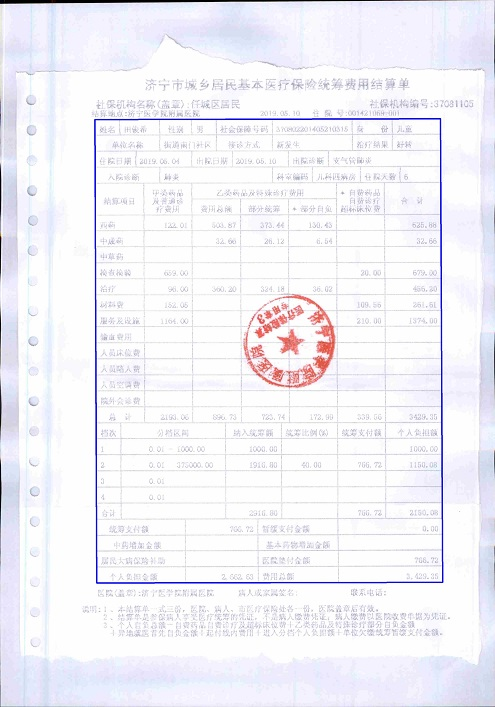
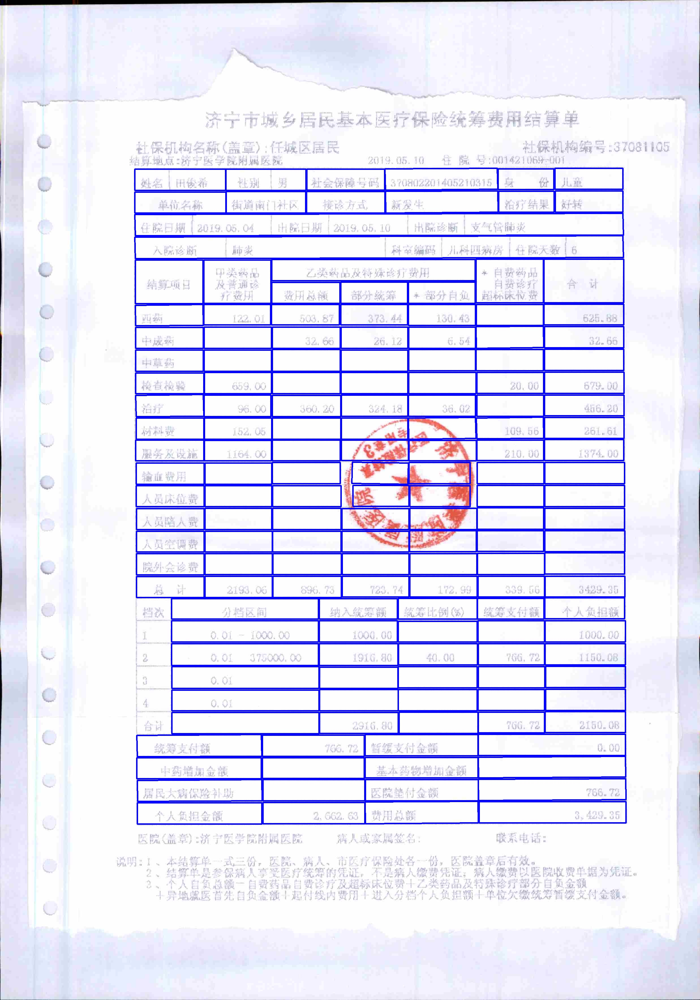
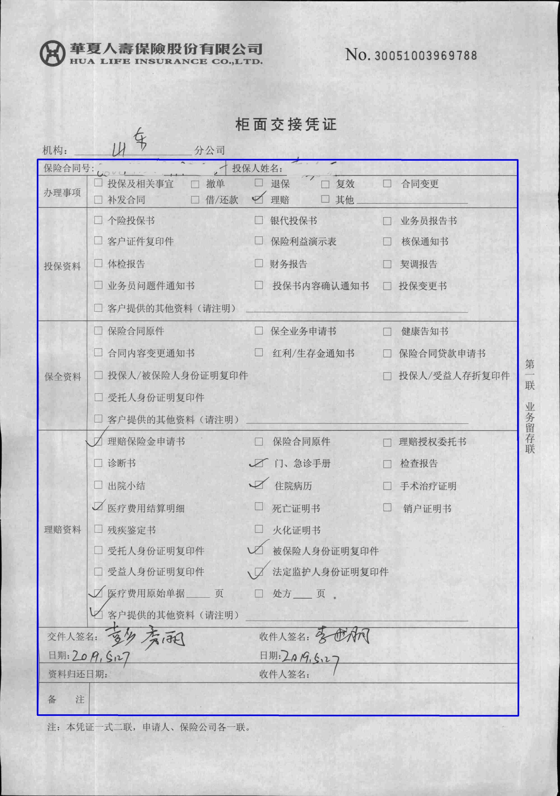
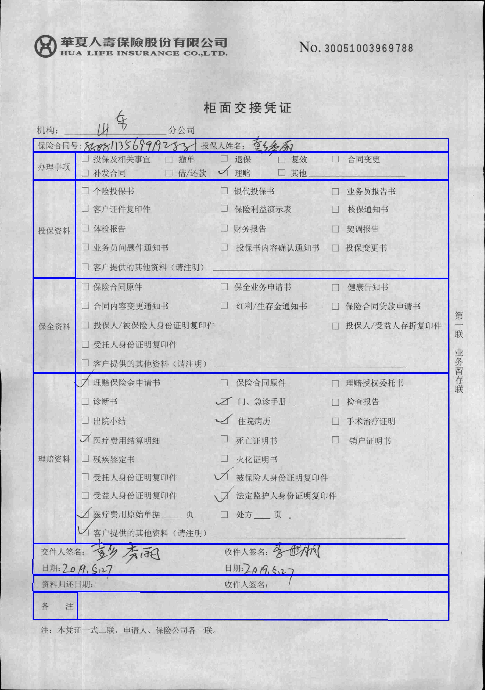
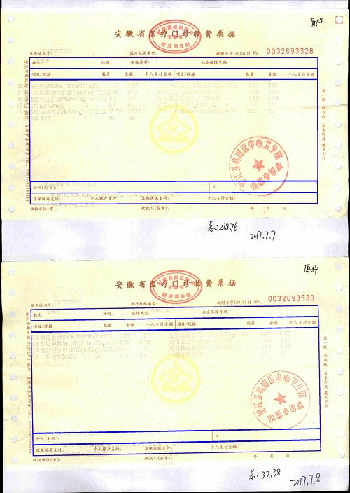
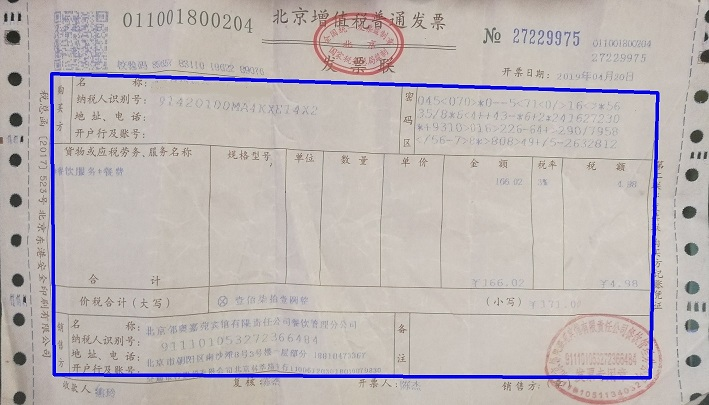
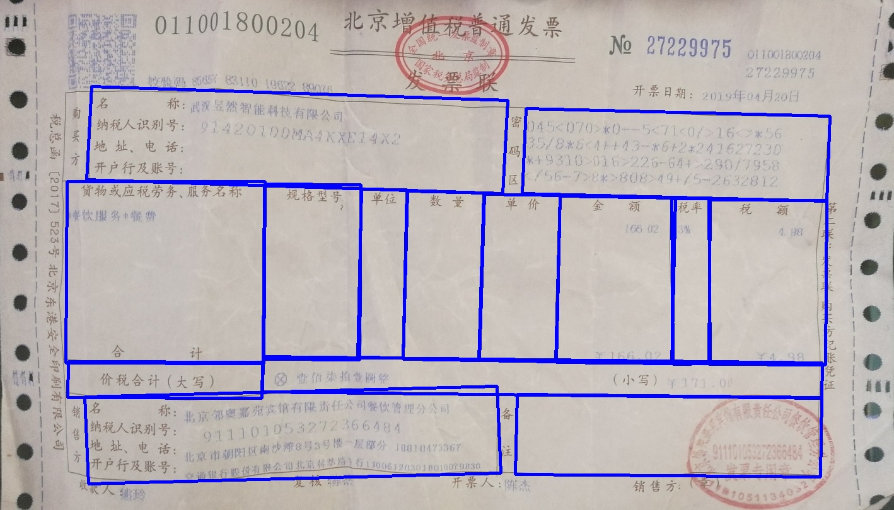

# **表格检测**  
   表格检测函数目前仅支持有线表格及三线表，有线表格需要线段完整且少量的断开。  三线表检测需要指定特征值长宽比作为三线表的特征。
     表格检测函数都是基于线段检测上做的方法，下边一一介绍。  

## 表格检测:  
	现有的应用场景的图像表格会出现一些干扰情况，如：点线、断线、盖章干扰等，此函数做了一些线段的校正如线段修复，单元格重构等。  
	函数大致做了一下线段的链接及筛选工作，具体就不详细解释了，下边来看一下效果图。本次测试数据没有微调参数，本函数参数微调更适应发票数据。    
 原图像地址:image/bg_1.png  
  
    
 原图像地址:image/bg_2.jpg  
  
    
 原图像地址:image/bg_4.jpg  
  
   

## 发票检测:  
	发票也属于是表格检测中的一种，但是相对有上边的那些单元格发票的单元格样式更为统一且单元格较大利于检测，  
	有时候一张图像上会出现多张发票，本文函数也进行了相应的处理。以下是效果图.  
 
 原图像地址:image/fp_1.jpg 
  
    
 原图像地址:image/bg_2.jpg  
  
    
 原图像地址:image/fp_4.jpg 
  
   